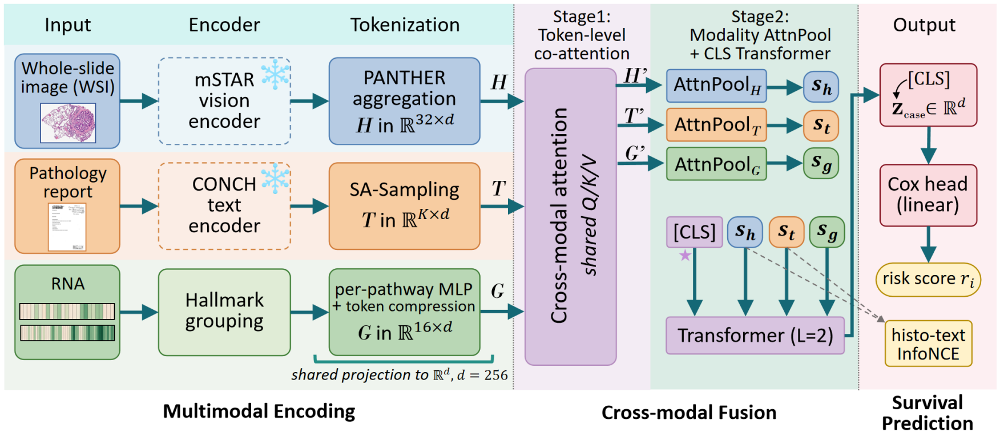
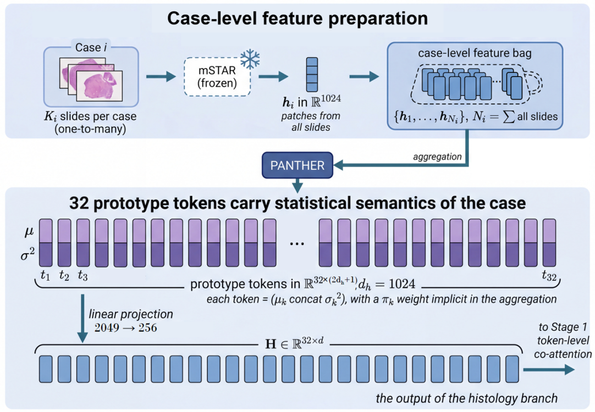
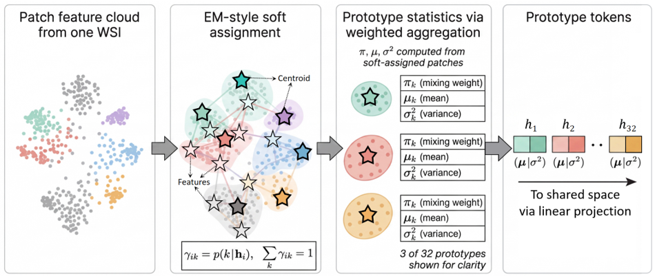
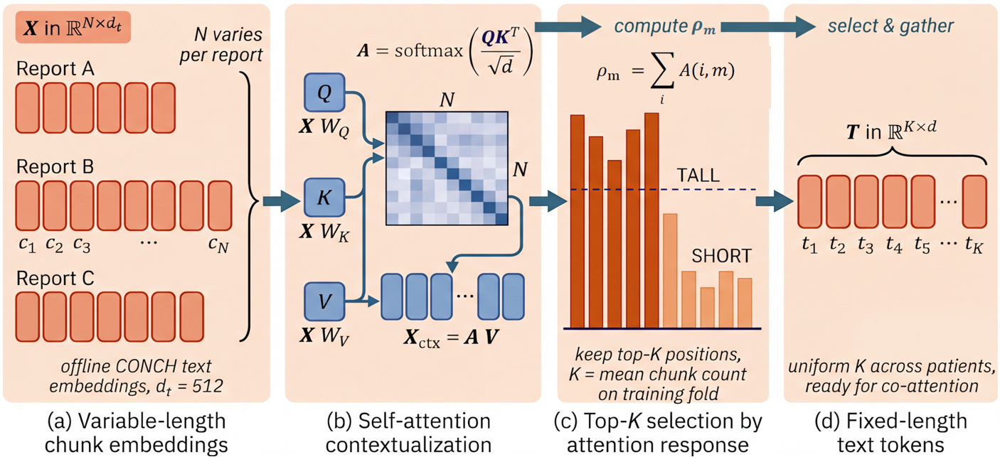
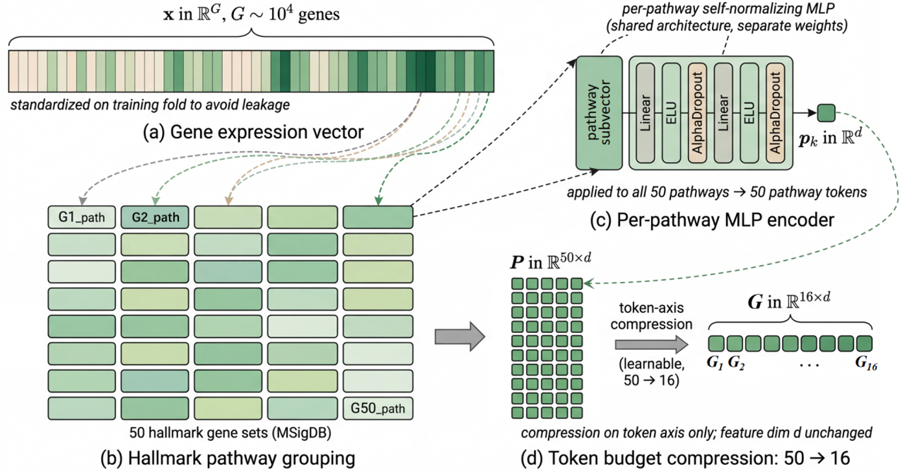
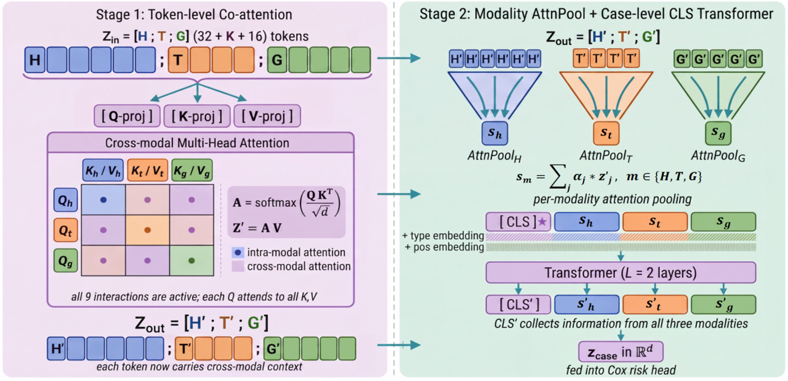
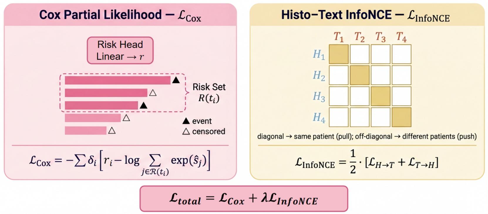

# Hierarchical Multimodal Fusion for Cancer Survival Prediction

A multimodal transformer that predicts cancer patient survival by fusing whole-slide histology images, pathology reports, and RNA transcriptomic data through a two-stage tokenization-and-fusion pipeline, evaluated with a 440+-run cross-validation protocol on five TCGA cohorts.

<p align="center">
  
</p>

## Overview

For each case, three encoders each produce a fixed-size set of tokens, which are then fused through a token-level co-attention stage followed by a modality-level summarization stage:

1. **Histology**: a frozen mSTAR encoder extracts patch-level features from whole-slide images; PANTHER prototype-based statistical modeling compresses the variable-size patch bag into 32 pathology prototype tokens.
2. **Pathology report**: a frozen CONCH encoder embeds report text into variable-length chunk embeddings; a self-attention-based length-reshaping module selects a fixed number of top-K tokens per training fold.
3. **RNA / transcriptomics**: gene expression is reorganized along the 50 MSigDB Hallmark pathways, encoded by a per-pathway self-normalizing MLP, then compressed from 50 pathway tokens down to 16.
4. All three token sets are linearly projected into a shared space (d=256), concatenated, and passed through token-level co-attention, per-modality attention pooling, and a shallow CLS-Transformer to produce a case-level representation for a Cox survival head.
5. Training combines a Cox partial-likelihood loss with a bidirectional histo-text InfoNCE contrastive loss to align the two independently pretrained vision/text encoders.

## Technical Design

This work builds on the three-modality framework proposed by PS3 [1], replacing the underlying histology and text foundation model encoders (mSTAR / CONCH), restructuring fusion from PS3's single-stage joint attention into a two-stage hierarchical form (token-level alignment -> modality-level summarization + CLS Transformer), and adding a bidirectional histo-text InfoNCE contrastive loss to mitigate representation-scale mismatch between the two independently-trained foundation models.

### Modality Tokenization

<details>
<summary><b>Histology:</b> WSI to patch feature bag (frozen mSTAR)</summary>
<p align="center">

</p>
</details>

<details>
<summary><b>Histology:</b> PANTHER prototype tokenization</summary>
<p align="center">

</p>
</details>

<details>
<summary><b>Pathology report:</b> variable-length text to fixed-length tokens</summary>
<p align="center">

</p>
</details>

<details>
<summary><b>RNA:</b> gene expression to Hallmark pathway tokens</summary>
<p align="center">

</p>
</details>

### Fusion and Training Objective

<details>
<summary><b>Two-stage fusion detail:</b> token-level co-attention, modality attention pooling, CLS Transformer</summary>
<p align="center">

</p>
</details>

<details>
<summary><b>Training objective:</b> Cox partial likelihood + histo-text InfoNCE</summary>
<p align="center">

</p>
</details>

### Design Choices

This work implements a complete three-modality survival prediction pipeline with the following design choices:

**Foundation model encoders:**
- **Histology**: frozen mSTAR encoder (Xu et al., Nature Communications 2025) for patch-level visual features, aggregated into 32 pathology prototype tokens via PANTHER (Song et al., CVPR 2024) statistical modeling
- **Text**: frozen CONCH encoder (Lu et al., Nature Medicine 2024) for pathology report embeddings, compressed to a fixed token budget via self-attention-based adaptive top-K selection

**RNA tokenization:**
- Gene expression reorganized along 50 MSigDB Hallmark biological pathways
- Per-pathway encoding via self-normalizing MLPs
- Explicit token budget compression (50 → 16 tokens) to balance cross-modal attention capacity

**Two-stage fusion architecture:**
- **Stage 1 (token-level)**: all three modality token sets pass through shared-space projection and token-level co-attention
- **Stage 2 (modality-level)**: per-modality attention pooling compresses each set into one summary token; the three summaries pass through a shallow CLS-Transformer for final case-level representation

**Cross-modal alignment:**
- Bidirectional InfoNCE contrastive loss between histology and text summary representations, added to mitigate representation-scale mismatch between independently-trained foundation models (mSTAR and CONCH)

**Evaluation protocol:**
- 5-fold cross-validation × 5 random seeds (25 runs per cohort, 125 runs total) across five TCGA cancer types (STAD, CRC, KIRC, LUAD, HNSC)
- Systematic ablation studies covering modality combinations and fusion structures
- Kaplan-Meier survival analysis with log-rank statistical testing

## Experiment Infrastructure

Beyond the model architecture itself, the experiment infrastructure was built to keep every reported number traceable and every batch of runs resumable and auditable:

- **Config-driven, self-documenting runs**: every batch script writes a `run_config.txt` alongside its outputs, capturing the full hyperparameter set, dataset/seed/fold list, and start/end timestamps -- any number in [RESULTS.md](RESULTS.md) can be traced back to the exact configuration that produced it.
- **Resumable, fault-tolerant batch execution**: sweeps spanning 125-180 runs (5 seeds x 5 folds x up to 5 cohorts) support `skip_existing`/`retry` semantics and per-run status logging to a TSV, so a crashed or OOM'd sweep can be safely re-launched without recomputing finished runs. `tmux_ctl` variants manage multi-hour sweeps as detached, restartable background sessions.
- **Decoupled reporting pipeline**: dedicated scripts (`export_formal_results_xlsx.py`, `export_mainline_results_xlsx.py`) aggregate raw per-run JSON logs into cross-validation summaries (mean/std/min/max by dataset, seed, and fold) and formatted spreadsheets -- running experiments and reporting results are separate, repeatable steps.
- **CI smoke testing**: a GitHub Actions workflow (`.github/workflows/smoke-tests.yml`) runs on every push/PR, installing CPU-only PyTorch and verifying that every core model/training module imports cleanly and exposes its expected entry points -- catching broken refactors before they reach a GPU box.
- **No-retrain statistical analysis pipeline**: the KM stratification stage reuses already-saved out-of-fold predictions (zero retraining) to compute per-seed and 5-seed-ensemble risk stratification, log-rank tests, and publication-ready figures programmatically.
- **Full provenance, no hand-copied numbers**: every figure in [RESULTS.md](RESULTS.md) is generated from a raw JSON/CSV artifact under `results/`, not transcribed by hand.

## Results

Full benchmark tables (13-baseline comparison), both ablation studies, and the KM survival analysis are in **[RESULTS.md](RESULTS.md)**; every number there is reproducible from the raw per-fold/per-seed logs under `results/`.

**Headline finding:** the two-stage hierarchical fusion architecture built in this project does **not** outperform a flat single-stage co-attention baseline on this data (0.676 vs. 0.685 mean C-index across CRC/LUAD/STAD). This is consistent with PS3's own ablation study, which tested a hierarchical fusion variant and found it 5.58% worse than their single-stage joint attention [1]. The result here should be read as an independent replication of that finding under a different encoder/data setup.

<details>
<summary>Why didn't staging the fusion help? (analysis)</summary>

The two-stage design was motivated by a specific hypothesis: that compressing each modality into a single summary token *before* cross-modal reasoning would reduce noise and let the model focus capacity on modality-level relationships instead of token-level clutter. Three things likely undercut that hypothesis on this data:

1. **Premature compression discards exactly the information co-attention needs.** Attention pooling into one summary token per modality happens *before* the model has had a chance to align individual histology prototypes with individual text chunks or pathway tokens. Fine-grained cross-modal correspondence (e.g., a specific pathology pattern lining up with a specific report phrase) can only be exploited by attention over individual tokens, not over three pre-averaged summaries. The flat co-attention baseline keeps all tokens live throughout, so it can still discover these correspondences; the two-stage design forecloses on them at the pooling step.
2. **Small sample sizes make deeper/staged architectures harder to fit, not easier.** These are TCGA cohorts of a few hundred cases per cancer type (253-391), fit under 5-fold cross-validation. The two-stage architecture adds a second attention-pooling stage plus a separate CLS-Transformer on top of the shared co-attention block, which is more parameters and more optimization surface for the same amount of data. On CRC/STAD in particular (the two smaller-signal-to-noise cohorts in this ablation), extra capacity without a matching increase in data tends to increase variance rather than reduce it.
3. **The token-budget compression already does a lot of the "focusing" work.** RNA is already compressed 50 -> 16 tokens and text is already reduced to a per-fold adaptive top-K before fusion even starts; histology is already summarized into 32 PANTHER prototypes rather than raw patches. Given that all three modalities already arrive at the fusion stage in a fairly compact, low-redundancy form, adding a second explicit summarization stage may be solving a problem (too many redundant tokens) that the tokenization stage had already solved.

None of this rules out two-stage fusion helping in a different regime (e.g., much larger cohorts, or modalities with less pre-compression) -- it specifically did not help under this tokenization scheme and this data scale.

</details>

KM survival stratification (log-rank testing on out-of-fold risk scores, no retraining) is also included -- see [RESULTS.md](RESULTS.md) for the full per-cohort table and figures.

[1] Raza et al., *PS3: A Multimodal Transformer Integrating Pathology Reports with Histology Images and Biological Pathways for Cancer Survival Prediction*, ICCV 2025. [arXiv:2509.20022](https://arxiv.org/abs/2509.20022)

<details>
<summary>Known Limitations</summary>

- **No trained checkpoints are included**, so results cannot be reproduced by loading a model directly -- only by re-running training end-to-end with your own extracted features (see Preparing Data / Running Experiments below).
- **No inference-only entry point.** The current code only exposes a training/evaluation loop (`main_survival_hierarchical_fusion.py`); there is no standalone `predict.py` that takes one case's features and returns a risk score.
- **Single-cohort, single-institution style evaluation.** All five cohorts are TCGA, collected under broadly similar protocols; the model has not been evaluated on external institutions, different scanners/staining, or non-US patient populations.
- **`requirements.txt` uses loose version bounds (`>=`)**, not a pinned lockfile, so exact reproducibility of the reported numbers is only guaranteed with the PyTorch/CUDA versions noted in Setup below.
- **CONCH/mSTAR are used as frozen, black-box feature extractors.** No analysis is provided on how sensitive results are to swapping either encoder for an alternative.
</details>

## Repository Layout

```text
hmf-survival/
|-- requirements.txt
|-- RESULTS.md                           # full benchmark tables, ablations, KM analysis
|-- assets/                              # method diagrams used in this README
|-- tests/
|   `-- test_imports.py                  # smoke test: core modules import cleanly, no GPU/data required
|-- .github/workflows/
|   `-- smoke-tests.yml                  # CI: runs the smoke test on every push/PR
|-- configs/
|   `-- PANTHER_default/config.json      # default PANTHER prototype-aggregation config
|-- results/                             # aggregated metrics + KM figures (no model weights)
|   |-- mainline_5cancer/
|   |-- ablation_modality/
|   |-- ablation_structure/
|   `-- km_stratification/
`-- src/
    |-- mil_models/                      # model definitions
    |   |-- model_multimodal_hierarchical_fusion.py   # two-stage fusion model (top-level module)
    |   |-- model_multimodal_encoders.py              # per-modality encoders / token construction
    |   |-- model_multimodal_cls_fusion.py            # shallow CLS-Transformer summary fusion
    |   |-- model_factory_hierarchical_fusion.py      # model builder / entry point
    |   |-- components.py                # attention (CoAttention/CoAttentionLayer) / FFN / survival head modules
    |   |-- model_PANTHER.py, PANTHER/   # PANTHER prototype-based statistical modeling
    |   |-- model_configs.py
    |   |-- text_processing.py, tokenizer.py
    |   `-- models/                       # ABMIL, text baseline, shared building blocks
    |-- training/
    |   |-- main_survival_hierarchical_fusion.py      # train/eval entry point
    |   `-- trainer_hierarchical_fusion.py            # training loop, checkpoint, metrics
    |-- wsi_datasets/                     # datasets and batch assembly
    |-- utils/                            # loss, scheduler, split I/O, misc utilities
    |-- scripts/survival/                 # batch run scripts for the mainline and both ablations
    |-- splits/                           # 5-fold train/test splits for 5 cancers (case_id, survival labels, no images/features)
    `-- data_csvs/rna/                    # Hallmark-pathway RNA expression matrices (derived from public TCGA data)
```

Not included in this repository: raw WSI slides, pre-extracted patch/text features (.pt), mSTAR/CONCH model weights, or any training checkpoint (.pth). These range from hundreds of MB to several GB and must be prepared separately (see below).

## Setup

Python 3.10+ and PyTorch 2.1+ are recommended (experiments were run with PyTorch 2.8.0 + CUDA 12.8 on a single RTX 3090).

```bash
pip install -r requirements.txt
```

Verify the core model/training code imports cleanly (no GPU or data required):

```bash
pip install pytest
python -m pytest tests/test_imports.py -v
```

Common issues:

- `ModuleNotFoundError: faiss`: if you use the original PS3 offline prototype pipeline, `main_prototype` can fall back to `--mode kmeans`.
- `torch.load(weights_only=...)` errors on PyTorch 2.6+: feature/text loading in this repo already handles this.

## Preparing Data

Three kinds of offline features must be prepared and organized per case before training:

1. WSI patch features: extract patch-level features from TCGA slides with mSTAR (or another pathology foundation model), producing one `.pt` file per slide (shape `(num_patches, 1024)`) under the directory passed as `--data_source` (a `feats_pt/` folder).
2. Pathology report embeddings: encode report text with CONCH, producing one `.pt` file per case under `--reports_dir`.
3. RNA expression matrices: already provided in `src/data_csvs/rna/hallmarks/<CANCER>/rna_clean.csv` (5 cancers, Hallmark-pathway reorganized), ready to use.
4. Splits: already provided in `src/splits/tcga-<cancer>/TCGA_<CANCER>_overall_survival_k=<fold>/` (train.csv, test.csv).

`splits/` covers the five cancers used in this evaluation: STAD, CRC(COADREAD), KIRC, LUAD, HNSC. WSI and report data originate from TCGA via the NCI GDC portal; cohort sizes:

| Cohort | Cases | Slides |
|---|---:|---:|
| STAD | 253 | 253 |
| CRC | 269 | 272 |
| KIRC | 328 | 331 |
| LUAD | 391 | 441 |
| HNSC | 385 | 405 |

## Running Experiments

Scripts under `src/scripts/survival/` reproduce every experiment reported above. Local paths inside the scripts have been replaced with placeholders (`/path/to/hmf-survival`, `/path/to/your/data_root`) -- override them via environment variables, or edit the variables at the top of each script directly:

```bash
export PROJECT_DIR=/your/local/path/to/hmf-survival
export DATA_ROOT=/your/local/path/to/extracted_features   # root holding feats_pt / reports_pt

bash src/scripts/survival/run_mainline_panther_attnpool_genehisto_5seed5fold.sh   # mainline: 5 cancers x 5 folds x 5 seeds
bash src/scripts/survival/run_p1_modality_contribution_ablation_3cancer_3seed5fold.sh  # ablation: modality combinations
bash src/scripts/survival/run_p1_fusion_structure_compare_3cancer_3seed5fold.sh        # ablation: fusion structures
bash src/scripts/survival/run_p1_survival_stratification_5cancer.sh                    # KM stratification + log-rank tests
```

Or call the training entry point directly with custom arguments:

```bash
python -m src.training.main_survival_hierarchical_fusion \
  --split_dir "$PROJECT_DIR/src/splits/tcga-stad/TCGA_STAD_overall_survival_k=0" \
  --data_source "$DATA_ROOT/tcga_stad/features_mstar_stad/feats_pt" \
  --reports_dir "$DATA_ROOT/tcga_stad/features_conch_stad/reports_pt" \
  --omics_dir "$PROJECT_DIR/src/data_csvs/rna" \
  --type_of_path hallmarks \
  --n_proto 32 --pathway_token_count 16 \
  --loss_fn cox --max_epochs 40
```

## Citation and Acknowledgments

This project builds on:

- Raza et al., PS3: A Multimodal Transformer Integrating Pathology Reports with Histology Images and Biological Pathways for Cancer Survival Prediction, ICCV 2025.
- Song et al., Morphological prototyping for unsupervised slide representation learning in computational pathology (PANTHER), CVPR 2024.
- Xu et al., A multimodal knowledge-enhanced whole-slide pathology foundation model (mSTAR), Nature Communications 2025.
- Lu et al., A visual-language foundation model for computational pathology (CONCH), Nature Medicine 2024.
- TCGA (The Cancer Genome Atlas): source of WSI and RNA data; report text sourced from the TCGA-Reports machine-readable dataset.

## Disclaimer

This repository is for academic research and reproducibility only and contains no patient-identifiable data. Everything under `src/data_csvs/rna/` and `src/splits/` consists of derived statistics from public TCGA data -- no imaging, raw sequencing reads, or patient-identifying information.
