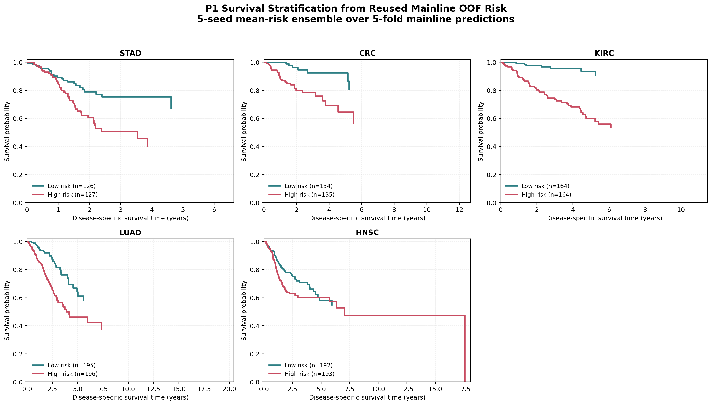

# Results

Full benchmark tables, ablation studies, and Kaplan-Meier survival analysis for the hierarchical multimodal fusion model. See the main [README](README.md) for architecture, the two-stage-vs-flat-fusion analysis, and known limitations.

Raw result artifacts live under `results/`: `mainline_5cancer/` (main protocol), `ablation_modality/`, `ablation_structure/` (two ablation studies), and `km_stratification/` (KM curves, log-rank tests, figures and tables).

## 5 TCGA cohorts, 5-fold x 5-seed, 125 runs

| Model | STAD | CRC | KIRC | LUAD | HNSC | Mean |
|---|---:|---:|---:|---:|---:|---:|
| ABMIL | 0.594 +/- 0.067 | 0.772 +/- 0.137 | 0.598 +/- 0.079 | 0.560 +/- 0.053 | 0.507 +/- 0.067 | 0.606 |
| 2-MLP | 0.578 +/- 0.080 | 0.678 +/- 0.069 | 0.764 +/- 0.042 | 0.508 +/- 0.064 | 0.595 +/- 0.076 | 0.625 |
| TransMIL | 0.558 +/- 0.035 | 0.671 +/- 0.120 | 0.736 +/- 0.085 | 0.594 +/- 0.096 | 0.594 +/- 0.070 | 0.631 |
| RRT-MIL | 0.603 +/- 0.088 | 0.575 +/- 0.035 | 0.704 +/- 0.128 | 0.557 +/- 0.091 | 0.556 +/- 0.056 | 0.599 |
| CLAM | 0.510 +/- 0.078 | 0.680 +/- 0.127 | 0.684 +/- 0.055 | 0.606 +/- 0.104 | 0.560 +/- 0.075 | 0.608 |
| MOTCat | 0.553 +/- 0.082 | 0.677 +/- 0.067 | 0.766 +/- 0.049 | 0.533 +/- 0.039 | 0.586 +/- 0.044 | 0.623 |
| MCAT | 0.572 +/- 0.074 | 0.661 +/- 0.101 | 0.762 +/- 0.030 | 0.512 +/- 0.040 | 0.578 +/- 0.064 | 0.617 |
| SurvPath | 0.608 +/- 0.048 | 0.640 +/- 0.054 | 0.761 +/- 0.054 | 0.567 +/- 0.055 | 0.536 +/- 0.055 | 0.622 |
| SurvivMIL | 0.492 +/- 0.068 | 0.663 +/- 0.057 | 0.654 +/- 0.101 | 0.568 +/- 0.048 | 0.552 +/- 0.086 | 0.586 |
| CMTA | 0.578 +/- 0.065 | 0.659 +/- 0.058 | 0.741 +/- 0.044 | 0.565 +/- 0.045 | 0.579 +/- 0.030 | 0.624 |
| FSM | 0.609 +/- 0.068 | 0.663 +/- 0.059 | 0.776 +/- 0.048 | 0.565 +/- 0.082 | 0.577 +/- 0.064 | 0.638 |
| PS3 | 0.638 +/- 0.045 | 0.826 +/- 0.101 | 0.776 +/- 0.061 | 0.640 +/- 0.093 | 0.627 +/- 0.066 | 0.701 |
| This work | 0.598 +/- 0.073 | 0.776 +/- 0.078 | 0.755 +/- 0.059 | 0.660 +/- 0.059 | 0.583 +/- 0.056 | **0.674** |

## Ablation: modality combination (CRC/LUAD/STAD, 3 seeds x 5 folds)

| Modalities | CRC | LUAD | STAD | Mean |
|---|---:|---:|---:|---:|
| Histology only | 0.697 +/- 0.089 | 0.583 +/- 0.052 | 0.605 +/- 0.069 | 0.628 |
| Histology + text | 0.717 +/- 0.097 | 0.602 +/- 0.064 | 0.545 +/- 0.066 | 0.622 |
| Histology + RNA | 0.764 +/- 0.074 | 0.616 +/- 0.051 | 0.635 +/- 0.071 | 0.672 |
| Histology + text + RNA (full) | 0.778 +/- 0.082 | 0.650 +/- 0.057 | 0.601 +/- 0.060 | 0.676 |

RNA is the modality that most consistently helps; adding text on top of histology is not consistently beneficial (it helps CRC, hurts STAD, where reports are more structured/templated).

## Ablation: fusion structure (CRC/LUAD/STAD, 3 seeds x 5 folds)

| Fusion structure | CRC | LUAD | STAD | Mean |
|---|---:|---:|---:|---:|
| Flat co-attention (single-stage, PS3-style) | 0.787 +/- 0.062 | 0.631 +/- 0.063 | 0.636 +/- 0.050 | **0.685** |
| Shallow CLS (late fusion) | 0.767 +/- 0.067 | 0.622 +/- 0.068 | 0.585 +/- 0.089 | 0.658 |
| Two-stage hierarchical (this work) | 0.778 +/- 0.082 | 0.650 +/- 0.057 | 0.601 +/- 0.060 | 0.676 |

On this data, the two-stage hierarchical structure does not outperform flat single-stage co-attention fusion. See the README for the full analysis of why.

## KM survival stratification (5-cancer ensemble out-of-fold)

| Cohort | Cases | Low/High risk | Ensemble OOF C-index | Log-rank p |
|---|---:|---:|---:|---:|
| STAD | 253 | 126/127 | 0.625 | 1.7e-03 |
| CRC | 269 | 134/135 | 0.785 | 1.2e-04 |
| KIRC | 328 | 164/164 | 0.758 | 4.3e-09 |
| LUAD | 391 | 195/196 | 0.667 | 4.7e-05 |
| HNSC | 385 | 192/193 | 0.584 | 0.070 |

Log-rank p < 0.01 (strongly significant) for KIRC, CRC, LUAD, STAD; HNSC reaches p = 0.070, near but below the conventional significance threshold. This part of the analysis is independent of the C-index numbers above and holds regardless of them.

[1] Raza et al., *PS3: A Multimodal Transformer Integrating Pathology Reports with Histology Images and Biological Pathways for Cancer Survival Prediction*, ICCV 2025. [arXiv:2509.20022](https://arxiv.org/abs/2509.20022)
